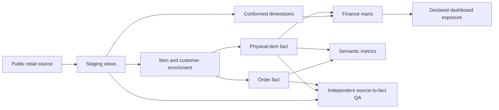

# Retail Analytics Platform: dbt, BigQuery and Business Contracts

A documented retail warehouse with order and physical-item facts, conformed dimensions, finance marts, semantic metrics and independent reconciliation. Two runnable case studies show how to prevent revenue fan-out and model checkout events across midnight.

**Author:** [Amir Ebrahim](https://www.linkedin.com/in/amirebrahim/) | Senior Analytics Engineer, Austin, Texas

[](https://github.com/PharaohFresh/analytics-engineering-portfolio/actions/workflows/offline-ci.yml)
[](https://github.com/PharaohFresh/analytics-engineering-portfolio/actions/workflows/dbt-ci.yml)
[](https://github.com/PharaohFresh/analytics-engineering-portfolio/actions/workflows/airflow-ci.yml)

The business problem is concrete: a dashboard can be wrong even when a pipeline succeeds. A creation-time watermark can miss a return; a customization join can repeat a sale; a session partition can omit a payment. This project makes those failure modes visible and tests the chosen contracts.

The warehouse uses Google's public `bigquery-public-data.thelook_ecommerce` sample dataset. Offline cases use original, invented records. No employer source code, private business records or credentials are included.

## A three-minute reviewer path

| Reader | Start here | What to look for |
|---|---|---|
| Recruiter or hiring manager | [Grain case](case_studies/grain_contracts/README.md) and [checkout case](case_studies/retail_telemetry/README.md) | A business problem, a reproducible result and a clear interpretation |
| Analytics engineer | [Item fact](models/marts/core/fct_order_items.sql), [finance marts](models/marts/finance/) and [tests](tests/) | Explicit grain, mutable-source handling and financial reconciliation |
| Data/platform engineer | [Independent contracts](scripts/qa_contracts.py), [orchestration](orchestration/README.md) and [regressions](offline_tests/) | Same-count corruption, target consistency, retries and rebuild policy |

## Capabilities demonstrated

| Capability | Executable evidence |
|---|---|
| Dimensional modeling | Staging, enrichment, order/item facts and customer/product/date/center dimensions |
| Business grain | Three orders, five physical units and seven customization records remain separate metrics |
| Mutable-source correctness | Older returns, tied timestamps, late arrivals and changed current product costs are reselected |
| Quality beyond counts | Eleven read-only checks compare keys, item values and parent assignments against source |
| Financial reporting | Composite mart grain checks and revenue/margin/unit/return-total reconciliation |
| Temporal event modeling | A session spanning two UTC partitions retains the next-day authorization |
| Governed consumption | Nine declared MetricFlow metrics, a product SCD-2 snapshot and a dashboard exposure |
| Operational consistency | Airflow build and QA share an explicit project, dataset and dbt target |

## Architecture and grain



- `fct_orders`: one row per `order_key`.
- `fct_order_items`: one row per `order_item_key`, one physical unit in this source.
- `mart_revenue_by_segment`: one row per `(traffic_source, country)`.
- `mart_product_category_margin`: one row per `(department, category)`.
- `snap_products`: separate SCD-2 product history. The fact currently joins the current product record rather than performing a historical cost lookup.

The declared [exposure](models/marts/_exposures.yml) records the finance marts' consumer. It is dependency metadata; this repository does not contain a live BI dashboard.

## Run the offline examples first

Use Python 3.12 or newer in a virtual environment. No warehouse account is needed for these commands. From the repository root:

```bash
python -m pip install -r requirements-offline.txt
python -m pytest offline_tests -q
python -m case_studies.grain_contracts --output artifacts/grain
python -m case_studies.retail_telemetry --output artifacts/telemetry
```

On Windows, `py -m venv .venv` creates an environment; run its interpreter as `.venv\Scripts\python.exe`. On macOS/Linux, use `python3 -m venv .venv` and `.venv/bin/python`. The two case-study demos themselves need only the standard library.

| Example | Reproduced result | Committed proof |
|---|---|---|
| Customization join | Naive join reports 85,000 cents; correct five-item contract reports 50,000 cents | [Grain report](case_studies/grain_contracts/example-report.json) |
| Missing catalog row | Inner join loses 12,000 cents; left join retains the unmapped valid sale | [Corrected query](case_studies/grain_contracts/fixtures/grain_safe.sql) |
| Cross-midnight checkout | Full session has one authorization; start-date-only filtering finds zero | [Telemetry report](case_studies/retail_telemetry/example-report.json) |
| Payment signals | Two recovered retries, one authorization-review candidate and one printer incident | [Interpretation and limits](case_studies/retail_telemetry/README.md) |

Multiple authorizations are review candidates, not confirmed duplicate charges. Routine API duration is excluded from incident flags. Each case explains which observations justify the result.

## Build the BigQuery warehouse

Use a separate Python 3.13 environment for the pinned warehouse dependencies. The build needs your own BigQuery project, dataset permissions, billing/quota capacity and Application Default Credentials. Query and storage costs depend on your account and workload; no free-tier guarantee is made.

```bash
python -m pip install -r requirements-warehouse.txt
gcloud auth application-default login
mkdir -p ~/.dbt
cp profiles.yml.example ~/.dbt/profiles.yml
export DBT_TARGET=dev BQ_PROJECT=your-gcp-project BQ_DATASET=dbt_dev
dbt build --target dev --full-refresh
python scripts/qa_audit.py
dbt docs generate --target dev
dbt docs serve
```

The shell setup above is Bash. In PowerShell, copy the [profile template](profiles.yml.example) to `$HOME\.dbt\profiles.yml`, then set `$env:DBT_TARGET='dev'`, `$env:BQ_PROJECT='your-gcp-project'` and `$env:BQ_DATASET='dbt_dev'`. Never commit the populated profile or credentials.

The independent QA script requires both `BQ_PROJECT` and `BQ_DATASET`; it does not guess the built target. Exit code `0` means all eleven contracts passed. Exit code `1` means a failed check or invalid runtime configuration.

## Why the incremental strategy changed

`item_created_at > max(item_created_at)` only sees newly created records. It misses a return on an older item, a late-arriving item and a new item tied with the maximum timestamp. It also cannot refresh a current product cost/category lookup for an old item.

The fact now selects all current enriched source rows and uses dbt's keyed BigQuery merge. This preserves repeat-run idempotency and updates mutable values, at the cost of scanning the current source every run. It is a correctness-first reference strategy, not a claim of low scan cost or a general high-volume CDC design.

Merge does not remove rows that disappeared from source. Independent key coverage/count checks detect that state; a reviewed `dbt build --target dev --full-refresh` realigns the fact. The weekly DAG provides a scheduled rebuild mode. Production-scale designs should choose a trustworthy update watermark, change log or bounded reprocessing policy and explicitly handle deletions.

`unit_cost`, category and margin reflect the current product record. Returns are a flag; sales totals include source sale prices rather than netting refunds. Sale-time cost accounting and recognized/net revenue need additional business contracts.

## Quality and verification

- Generic dbt tests assert source/core keys and relationships.
- Four [singular finance tests](tests/) assert each composite grain and reconcile aggregate money, units and returns. Public sample prices are floating-point values; money checks use an explicit `max(1e-6, abs(expected) * 1e-9)` tolerance.
- Eleven [independent QA queries](scripts/qa_contracts.py) check row counts, unique/non-null keys, bidirectional source coverage, orphan items, prices and item state/parent/product enrichment by stable key.
- [Offline regressions](offline_tests/test_warehouse_sql.py) exercise the actual rendered item/enrichment/finance SQL and singular tests on invented SQLite tables. They reproduce old returns, timestamp ties, late arrivals, changed costs/categories, missing source rows and same-count corruption, including offsetting price errors.
- [Configuration tests](offline_tests/test_configuration.py) render the actual profile template and compare default/overridden targets with the Airflow environment helper. Linux DagBag tests verify imports, dependencies, task environments and retry policy.

The SQLite harness translates selected BigQuery SQL and simulates keyed replacement. It verifies source selection and these business contracts; it does not execute dbt-generated BigQuery MERGE DML or prove all BigQuery numeric/dialect behavior. Credentialed CI remains the warehouse engine check.

Local October 6 verification: 51 offline tests and both demos passed on Python 3.12 and 3.14; native `dbt parse` passed on Python 3.13 with dbt-core 1.11.11/dbt-bigquery 1.11.3 using a dummy OAuth profile. No fresh local BigQuery build or Linux Airflow run is claimed. The older July/August hosted successes describe earlier revisions; use current [Actions](https://github.com/PharaohFresh/analytics-engineering-portfolio/actions) and PR checks for the delivered revision.

## CI, catalog and promotion

Three workflows separate portable contracts, Linux Airflow structure and credentialed BigQuery build/QA. BigQuery CI builds `dbt_ci` with a full refresh; runs are serialized because they share that dataset. This pipeline does not deploy the `prod` profile.

Static dbt catalog publication is configured to run only after a successful build on `main`. GitHub Pages must be enabled with GitHub Actions as its source. Until a deployment succeeds, no live catalog is claimed; local `dbt docs serve` works after a warehouse build.

[Governance](GOVERNANCE.md) retains separate development/production targets and human review before production promotion. A passing local demo or PR check does not authorize that promotion.

## Repository map

```text
models/staging/       source contracts and typed views
models/intermediate/ item/customer enrichment
models/marts/        dimensions, facts, finance marts and exposure
models/semantic/     two semantic models and nine metric definitions
snapshots/           product SCD-2 history
scripts/             independent BigQuery QA and reusable query contracts
orchestration/       daily keyed merge, weekly rebuild and DagBag tests
offline_tests/       actual-SQL regressions and configuration/business checks
case_studies/        original grain and complete-session examples
runbooks/            model review, QA, mart creation and assisted delivery
```

Related projects: [governed lineage delivery](https://github.com/PharaohFresh/agentic-analytics-delivery), [query optimization](https://github.com/PharaohFresh/governed-query-optimizer) and [booking revenue reconciliation](https://github.com/PharaohFresh/revenue-reconciliation-pipeline). [MIT license](LICENSE).
