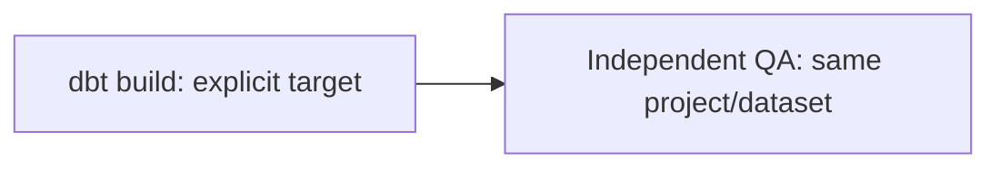

# Airflow orchestration: build and verify the same target

One factory creates two small DAGs. Each builds dbt, then runs independent BigQuery reconciliation as a separate task with its own failure state.

| DAG | America/Chicago schedule | Build policy |
|---|---|---|
| `dbt_platform_daily` | 06:00 daily | Full-source keyed merge for mutable item state |
| `dbt_platform_weekly_full_refresh` | Sunday 22:00 | `dbt build --full-refresh` to realign deleted/regenerated source keys |

The daily merge scans all current enriched source rows. It retains updates, ties and late arrivals but does not remove disappeared keys. The weekly rebuild and independent key/count checks address that separate failure mode. No cheap-scan claim is made.



## Explicit environment contract

[platform_config.py](platform_config.py) resolves the target once and supplies the same dictionary to both `BashOperator` tasks. The [profile template](../profiles.yml.example) consumes those variables.

| Variable | Default | Meaning |
|---|---|---|
| `DBT_TARGET` | `dev` | `dev` or reviewed `prod` deployment |
| `BQ_PROJECT` | `career-analytics-portfolio` | Personal sample-project placeholder; override for your deployment |
| `BQ_DATASET` | `dbt_dev` for dev; `analytics` for prod | Both build output and QA read target |
| `DBT_PROJECT_DIR` | Repository root relative to the DAG | Deployed project directory |

Both commands quote environment expansions, so paths with spaces are not concatenated into the shell program. `append_env=True` retains worker `PATH` and Application Default Credentials while explicit target variables override inherited values. Credentials are never literal DAG values.

Use the provided profile convention on the worker. A custom profile that ignores these variables can break the contract. Do not deploy a production target from a laptop; follow the repository's [human-review promotion policy](../GOVERNANCE.md).

## What is tested

Portable [configuration tests](../offline_tests/test_configuration.py) render the actual profile and compare development/production defaults and overrides. Linux [DagBag tests](tests/test_dagbag.py) check:

- clean imports and both expected DAG IDs;
- build before independent QA;
- `catchup=False`, retries and exponential backoff;
- only the weekly DAG passes `--full-refresh`;
- both tasks share project/dataset/target and inherit the worker environment.

These are structure tests, not evidence that a scheduler or a warehouse run succeeded.

## Run on Linux, macOS, WSL or a Linux container

Airflow is not tested as a native Windows deployment. The hosted workflow uses Python 3.12 and the Airflow release's constraints:

```bash
python -m pip install "apache-airflow==3.3.0" pytest --constraint \
  "https://raw.githubusercontent.com/apache/airflow/constraints-3.3.0/constraints-3.12.txt"
python -m pytest orchestration/tests -q
```

For a worker that actually executes the tasks, also install [warehouse dependencies](../requirements-warehouse.txt), place the dbt profile under the worker's profile directory and provision scoped credentials. Ship the entire repository rather than only `dags/`; the factory imports the shared configuration helper and both tasks run repository scripts/models.

```bash
export AIRFLOW__CORE__DAGS_FOLDER="$(pwd)/orchestration/dags"
export DBT_TARGET=dev BQ_PROJECT=your-gcp-project BQ_DATASET=dbt_dev
airflow standalone
```

No scheduler service is started by the offline examples. [BashOperator's environment behavior](https://airflow.apache.org/docs/apache-airflow-providers-standard/stable/_api/airflow/providers/standard/operators/bash/index.html) explains why both `env` and `append_env` are explicit.
